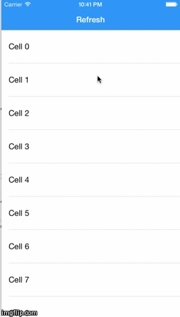

# MAPullToRefresh

`MAPullToRefresh` is the simplest way to implement a great looking pull-to-refresh function on your UITableViews, UITableViewControllers, and UIScrollViews. A category on UIScrollview and implementation with just a few lines of code. It works right out the box! 



## Requirements

`MAPullToRefresh` uses ARC and requires iOS 7.0+. Works for iPhone and iPad.

## Installation

### Manual

Copy the folder `MAPullToRefresh` to your project.

## Usage

The pull-to-refresh only takes a few lines to add to your view controller. You can directly customize the functionality in the category file if you wish. 

#### Example
This code

```	objc

- (void)viewDidLoad {
[super viewDidLoad];
// Do any additional setup after loading the view, typically from a nib.
self.tableView.delegate = self;
self.tableView.dataSource = self;

__weak typeof(self) weakSelf =self;
[self.tableView addPullToRefreshWithActionHandler:^{

//Call your method here
[weakSelf startRefreshing];

}];


}

-(void)startRefreshing{

//terminate the refresh after 2 seconds. place 'stopAnimating' after your refresh is completed

__weak typeof(self) weakSelf =self;
int64_t delayInSeconds = 2.0;
dispatch_time_t popTime = dispatch_time(DISPATCH_TIME_NOW, delayInSeconds * NSEC_PER_SEC);
dispatch_after(popTime, dispatch_get_main_queue(), ^(void){

//Stop the refresh by calling this method
[weakSelf.tableView.pullToRefreshView stopAnimating];

});
}
```
## License

The MIT License (MIT)

Copyright (c) 2015 Michael Ackley

Permission is hereby granted, free of charge, to any person obtaining a copy
of this software and associated documentation files (the "Software"), to deal
in the Software without restriction, including without limitation the rights
to use, copy, modify, merge, publish, distribute, sublicense, and/or sell
copies of the Software, and to permit persons to whom the Software is
furnished to do so, subject to the following conditions:

The above copyright notice and this permission notice shall be included in
all copies or substantial portions of the Software.

THE SOFTWARE IS PROVIDED "AS IS", WITHOUT WARRANTY OF ANY KIND, EXPRESS OR
IMPLIED, INCLUDING BUT NOT LIMITED TO THE WARRANTIES OF MERCHANTABILITY,
FITNESS FOR A PARTICULAR PURPOSE AND NONINFRINGEMENT. IN NO EVENT SHALL THE
AUTHORS OR COPYRIGHT HOLDERS BE LIABLE FOR ANY CLAIM, DAMAGES OR OTHER
LIABILITY, WHETHER IN AN ACTION OF CONTRACT, TORT OR OTHERWISE, ARISING FROM,
OUT OF OR IN CONNECTION WITH THE SOFTWARE OR THE USE OR OTHER DEALINGS IN
THE SOFTWARE.